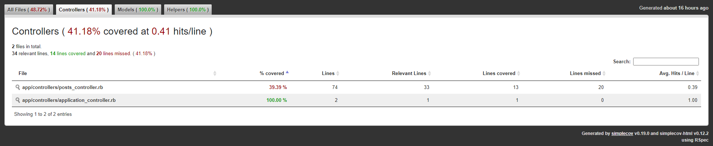

# Instrucciones SimpleCov

`SimpleCov` es una gema que genera reportes de covertura al ejecutarse la _suite_ de tests. Para utilizarla, solamente hay que seguir algunos pasos.

## Requisitos previos 🥱

Los requisitos previos son, básicamente, tener `RSpec` instalado en el proyecto. **Estos pasos probablemente deberían haber sido seguidos para el Sprint 0**, pero quedarán explicitados nuevamente **solo por si acaso**.

1. Tener `rspec` en el `Gemfile` del proyecto. Para agregarlo, se puede ejecutar lo siguiente:

    ```sh
    $ bundle add rspec
    ```

2. Tener `rspec-rails` en el `Gemfile` del proyecto.Para agregarlo, se puede ejecutar lo siguiente:

    ```sh
    $ bundle add rspec-rails
    ```

3. Tener las gemas instaladas. Para instalarlas, se puede ejecutar lo siguiente:

    ```sh
    $ bundle install
    ```

4. Haber instalado `rspec` al proyecto. Es decir, debería haber una carpeta llamada `spec` en el proyecto. Para instalar `rspec`, se puede ejecutar lo siguiente:

    ```sh
    $ bundle exec rails generate rspec:install
    ```

## Pasos para instalar SimpleCov 👣

La idea de `SimpleCov` es que, cada vez que se ejecute la _suite_ de tests, se genere un reporte con el porcentaje de cobertura. Los pasos para conseguir esto son bastante simples.

1. Instalar `simplecov`. Para hacer esto, se puede ejecutar lo siguiente:

    ```sh
    $ bundle add simplecov
    ```

2. Instalar las gemas. Para para esto, se puede ejecutar lo siguiente:

    ```sh
    $ bundle install
    ```

3. "Explicarle" a `RSpec` que debe generar un reporte con `SimpleCov` cada vez que se ejecuta la _suite_ de tests. Para eso, se debe editar el archvio `spec/spec_helper.rb` y agregarle **al principio del archivo** lo siguiente:

    ```rb
    require 'simplecov'
    SimpleCov.start do
        add_filter '/config/'
        add_filter '/spec/'
        add_filter '/test/'
        add_filter '/vendor/'

        add_group 'Controllers', 'app/controllers'
        add_group 'Models', 'app/models'
        add_group 'Helpers', 'app/helpers'
    end
    # This outputs the report to your public folder
    # You will want to add this to .gitignore
    SimpleCov.coverage_dir 'public/coverage'
    ```

    Luego de esto, el archivo `spec/spec_helper.rb` debería verse parecido a lo siguiente (excluyendo líneas comentadas):

    ```rb
    require 'simplecov'
    SimpleCov.start do
        add_filter '/config/'
        add_filter '/spec/'
        add_filter '/test/'
        add_filter '/vendor/'

        add_group 'Controllers', 'app/controllers'
        add_group 'Models', 'app/models'
        add_group 'Helpers', 'app/helpers'
    end
    # This outputs the report to your public folder
    # You will want to add this to .gitignore
    SimpleCov.coverage_dir 'public/coverage'

    RSpec.configure do |config|
        .
        .
        .
    end
    ```

4. Agregar la carpeta generada por `SimpleCov` al archivo `.gitignore` (si no hay un `.gitignore` en el repositorio, se debe crear uno). Para hacer esto, solamente es necesario agregar la siguiente línea al final del archivo `.gitignore`:

    ```
    public/coverage
    ```

## ¿Cómo sé si lo hice bien? 🤔

Para saber si está _to' gucci_, podemos ejecutar la _suite_ de tests! Para eso, puedes ejecutar lo siguiente:

```sh
$ bundle exec rspec
```

Eso debería mostrar en tu consola los _tests_ que hasta ahora hay en tu app (y decirte si pasaron o no). Luego, si vas a la carpeta `public/coverage`, encontrarás un archivo llamado `index.html`. Si abres ese archivo en tu navegador, podrás ver algo similar a esto:



El reporte explica cuántas líneas hay testeadas de cada controlador, modelo y módulo de _helpers_. Congratulaciones! 🐳

Créditos: [@daleal](https://github.com/daleal)
